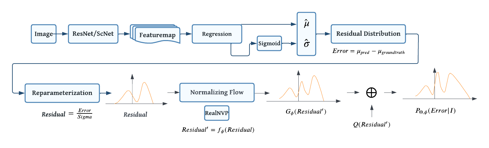

# 8501-Project

## Introduction

Our work is centered around an existing tool, MMPose. MMPose is an open-source toolbox for pose estimation based on PyTorch. It is a part of the OpenMMLab project. 

What I want to state here is that although we use the code in MMPose, we do not simply copy it. On the contrary, we fully understand the complete code running logic of each part of the code. Moreover, what we use are very mature codes that are already open source. Because these codes are already very mature, we think there is no need to rewrite them.
We just use MMPose as a tool to help us save time to quickly train the model and decide on subsequent adjustments based on the results. It is worth noting that the parameters of the model are still defined by ourselves, and we provide the Config script for each model we run as well as the task script submitted to ANU DUG.

At the same time, we also spent some initial time configuring and testing the mmpose environment on the ANU DUG. This was not a simple thing, so I think this can also be counted as the workload of our team. We provide complete instructions for configuring MMPose on ANU DUG.

In the early days of the project, we spent some money configuring and testing the mmpose environment on the ANU DUG. This was not a very easy task, so I think this can also be counted as one of the team's workload. At the same time, we provide a complete instruction manual for configuring MMPose on ANU DUG.

The code we mainly use includes three parts, the Backbone part, the Rleloss part and the NF part. The codes for these three parts are in corresponding folders. Among them, the backbone part includes the three backbones used in this article, namely alexnet, resnet and scnet. The Rleloss part includes RleHeadStructure and Rleloss used in this article. The NF part includes the NF model used in this article, RealNVP.

## About our work
In human pose estimation, heatmap-based methods have achieved superior performance but at the cost of higher computational demands, impeding real-time applications. Conversely, regression-based methods, exemplified by DeepPose, are more efficient but lag in accuracy. In this work, we propose SCNet-RLE, a novel framework that merges the Self-Calibrated Convolutions (SCC) from SCNet with the Residual Log-likelihood Estimation (RLE), aiming to enhance the accuracy of regression-based pose estimation while maintaining computational efficiency. The SCC module enriches the receptive field, capturing more contextual information without additional parameters, whereas RLE transitions the regression paradigm to a probabilistic domain, considering the residuals between predicted and true joint coordinates. We conducted extensive evaluations on the COCO dataset, where our SCNet-101 + RLE configuration achieved an AP of 0.701, significantly advancing over the conventional regression-based methods. Moreover, SCNet-RLE demonstrates competitive performance in comparison to heatmap-based methods while maintaining higher computational efficiency, enabling the possibility for real-time deployments. Our ablation studies further explore the effects of SCNet and RLE, aiming to find a balance between accuracy and efficiency in human pose estimation tasks. 

The structure of our model:

## Quick Navigate
Quick look: 

Results (pth): [Results](https://github.com/ZhengyuOfficial/8501-Project/tree/main/ExperimentResults) & [Google Drive](https://drive.google.com/drive/folders/1vb5a1zklKBmfYHJYYNQhOYPxCQjfzia0)

Configuration file: [Config](https://github.com/ZhengyuOfficial/8501-Project/tree/main/configs/custom)

Visualization section: [Visualization](https://github.com/ZhengyuOfficial/8501-Project/tree/main/Visualization)

## About this directory
- `8501-Project/mmpose/models/heads/regression_heads
/rle_head.py`:Top-down regression head introduced in `RLE`_ by Li et al(2021). The head is composed of fully-connected layers to predict the coordinates and sigma(the variance of the coordinates) together.
- `8501-Project/mmpose/models/losses
/regression_loss.py`: Code about Residual Log-Likelihood Estimation Loss and SmoothL1Loss
- `8501-Project/mmpose/models/utils
/realnvp.py`: Code about density estimation using Real NVP
- `8501-Project/models/backbones/alexnet.py`: Code about AlexNet.
- `8501-Project/mmpose/models/backbones
/resnet.py`: Code about ResNet backbon
- `8501-Project/mmpose/models/backbones
/scnet.py`: Code about SCNet backbon
- `8501-Project/configs/custom/*.py`: Config file customized based on different models and parameters
- - `configs/custom/*.py`:
- `8501-Project/sh/.sh`: Scripts on ANU DUG to invoke mmdetection apis.
- `8501-Project/ExperimentResults`: Stores the results of our experiments
- `8501-Project/MMPose_Configuration_on_ANU_DUG`：Instructions for configuring MMPose on an ANU DUG
- `8501-Project/figure/*`：Store the images used in this experiment
